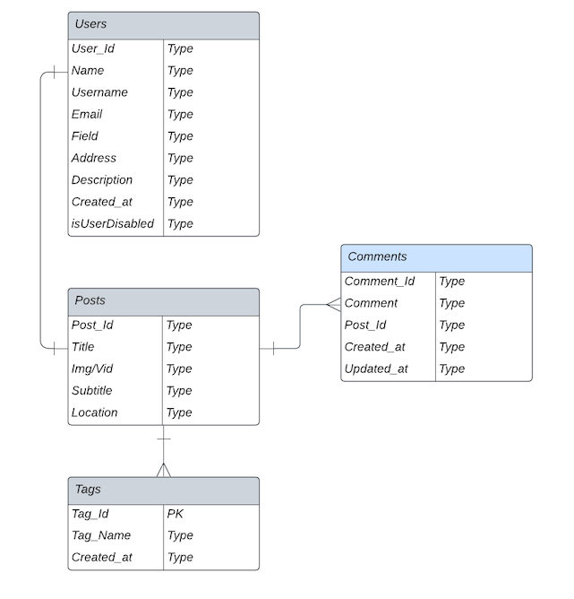

# User Persona

## 1. Ram, a gen-z college going student:

1.1. **Ram's Vital Statistics**
* Ram is a 19 year old boy studying in college.
* He is from a small town in India.

1.2 **Ram's Goals and Needs**
* Ram wants to be aware with what his friends and knowns are doing.
* Ram wants to stay updated with what is happening around in his locality.
* Ram wants to know about the filmy gossips.
* Ram wants to follow his favourite body-builder to see his workout.

1.3 **Ram's Everyday Activities**
* Goes to college in morning and stays there till evening on weekdays.
* He sometimes goes for a walk or to hangout with friends in some local cafe.
* He also likes traveling and would go for small bike rides occassionaly.
* He is a gym rat, and never forgets to do his 1hr workout.

1.4 **Ram's Device and Internet Usage**
Desktop devices - 10%
Mobile Devices - 90%
Social Media - 40%
Technical Know-how - 80%

## 2. Adenium Bakers, a new outlet in town:
2.1. **Adenium Baker's Vital Statistics**
* Adenium Bakers is a new bakery in town.
* Adenium Bakers is having in-store and takeaway facilities.
* Adenium Bakers has nice ambience and people are loving the place.

2.2 **Adenium Baker's Goals and Needs**
* Adenium Bakers want to advertise their products.
* They want to advertise their outlet's location.
* They want to advertise it as a chill place where people can have fun time with their loved ones.
* They want to advertise about their bulk products which they provide at wholesale rates.

2.3 **Adenium Baker's Everyday Activities**
* They prepare the items as per the demand and keep them available at all the times.
* They put emphasis on the quality of their product and take care of hygiene.
* The owner knows that to grow the business, they need to advertise using social media, and is looking for a platform to connect with people.

2.4 **Adenium Baker's Device and Internet Usage**
* Desktop devices - 80%
* Mobile Devices - 20%
* Social Media - 90%
* Technical Know-how - 30%

## 3. Sita, new age 'influencer' wannabe
3.1. **Sita's Vital Statistics**
* Sita is a 21yr old girl.
* She has just graduated from college with a degree she doesn't know what to do about.
* She wants be become famous.

3.2 **Sita's Goals and Needs**
* Sita wants to become an 'influencer'.
* Sita wants a platform for her photos and videos to reach a large audience.
* Sita wants to make her reach to advertising media house so that they provide her with some work.
* Sita wants a platform to make her reach to brands to advertise their products on her profile.

3.3 **Sita's Everyday Activities**
* Sita is into fitness and does yoga and goes to gym.
* Sita is diet conscious and follows her diet chart religiously.
* Sita is very social and likes to meet new people and make friends with them.

3.4 **Sita's Device and Internet Usage**
* Desktop devices - 10%
* Mobile Devices - 90%
* Social Media - 90%
* Technical Know-how - 70%
  
  

# User Stories

1. As a user, ISBAT post photos and videos, so that other people can see them.
2. As a user, ISBAT see posts from other people that I follow.
3. As a user, ISBAT give my thumbs up to post that I like.
4. As a user, ISBAT comment on the posts.
5. As a user, ISBAT share the post with my contacts on the platform.
6. As a user, ISBAT share the post with other contacts that I have on other platforms.
7. As a user, ISBAT send private messages to the contacts on the platform.
8. As a user, ISBAT save the posts to watch later.

  

# Database schema

